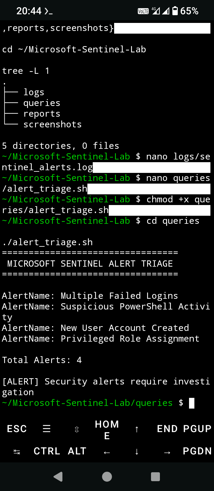
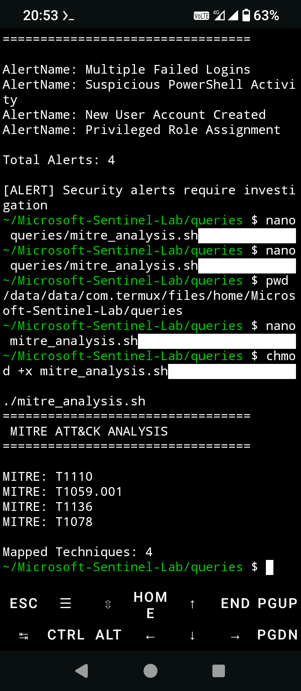
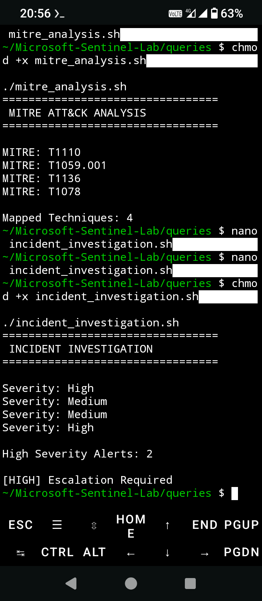

Microsoft Sentinel Lab

Overview

A cybersecurity project focused on Microsoft Sentinel alert triage, incident investigation, threat detection, and MITRE ATT&CK mapping.

This lab demonstrates how Security Operations Center (SOC) analysts use Microsoft Sentinel to investigate security alerts, perform triage, correlate events, and document findings.

---

Features

Alert Triage

Investigates Microsoft Sentinel alerts and identifies suspicious activity.

MITRE ATT&CK Analysis

Maps security alerts to MITRE ATT&CK techniques.

Incident Investigation

Performs severity analysis and escalation decisions.

Security Reporting

Documents incidents and response recommendations.

---

Screenshots

Alert Triage

### Alert Triage

### MITRE ATT&CK Analysis

### Incident Investigation

---

MITRE ATT&CK Coverage

Technique| Description
T1110| Brute Force
T1059.001| PowerShell
T1136| Create Account
T1078| Valid Accounts

---

Technologies Used

- Microsoft Sentinel
- MITRE ATT&CK
- Linux
- Bash
- Git
- GitHub
- Termux

---

Reports

Investigation Report

Location:

reports/sentinel_investigation_report.txt

MITRE Mapping

Location:

reports/mitre_mapping.md

---

Project Structure

Microsoft-Sentinel-Lab/

├── logs
│   └── sentinel_alerts.log

├── queries
│   ├── alert_triage.sh
│   ├── incident_investigation.sh
│   └── mitre_analysis.sh

├── reports
│   ├── mitre_mapping.md
│   └── sentinel_investigation_report.txt

├── screenshots
│   ├── alert_triage.png
│   ├── incident_investigation.png
│   └── mitre_analysis.png

└── README.md

---

Learning Outcomes

- Microsoft Sentinel Investigation
- Alert Triage
- Incident Investigation
- Threat Detection
- MITRE ATT&CK Mapping
- Security Monitoring
- SOC Operations
- Incident Response

---

Portfolio Value

This project demonstrates:

- Microsoft Sentinel Skills
- SIEM Investigation Workflows
- Alert Triage Procedures
- Threat Detection Methodology
- Incident Investigation
- MITRE ATT&CK Mapping
- Security Reporting

---

Author

Thabo Sakonta

Microsoft Certified Security Operations Analyst (SC-200)

GitHub: https://github.com/thabosakonta-wq

LinkedIn: https://www.linkedin.com/in/thabo-sakonta-377a3748

---

License

This project is provided for educational and portfolio purposes.
